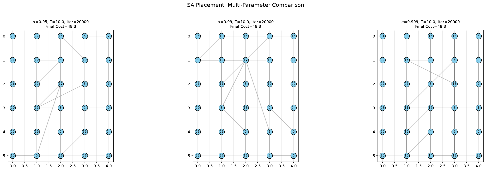
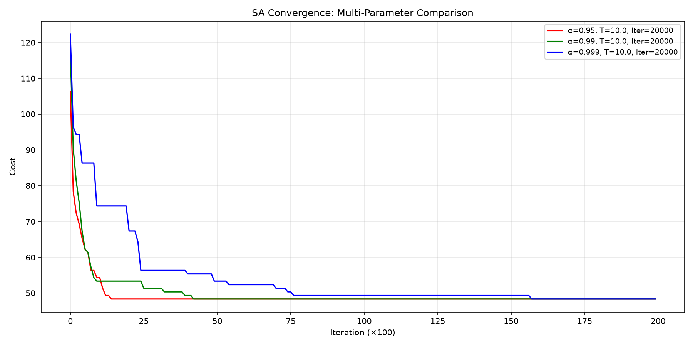

# 模拟退火算法在布局优化上的应用

## 1. 项目简介
本项目利用模拟退火算法（Simulated Annealing, SA）解决一个5x6网格、20个模块的布局优化问题。目标是最小化连接线长，同时通过罚函数平衡每行的模块密度。

## 2. 算法核心
- **状态定义**：模块在30个槽位中的排列。
- **成本函数**：所有连线曼哈顿距离之和 + 行密度惩罚。
- **邻域移动**：随机交换两个模块的位置。
- **Metropolis准则**：以一定概率接受劣解，避免陷入局部最优。

## 3. 实验结果

### 3.1 不同降温速率下的布局对比

*图1：α=0.95, 0.99, 0.999 三种降温速率下的最终布局。*

### 3.2 收敛曲线对比

*图2：三种参数下的成本下降曲线。*

## 4. 如何运行
1. 安装依赖库：
   ```bash
   pip install numpy matplotlib
2. 直接运行 `main.py` 或对应的主程序文件，程序会自动生成对比图并保存到当前文件夹。
